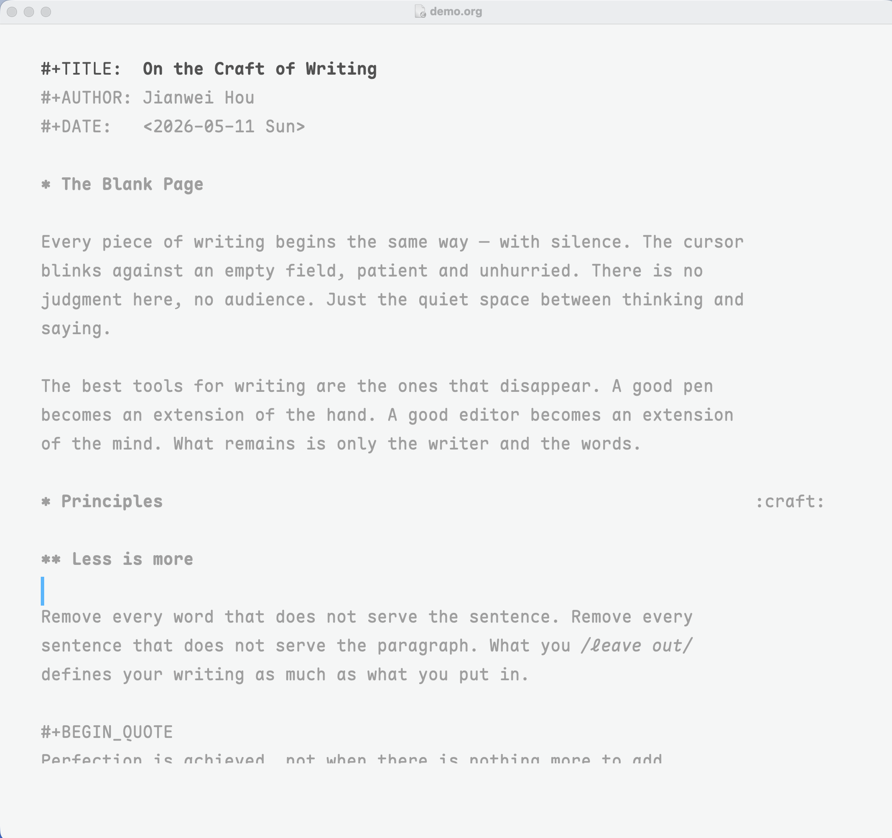
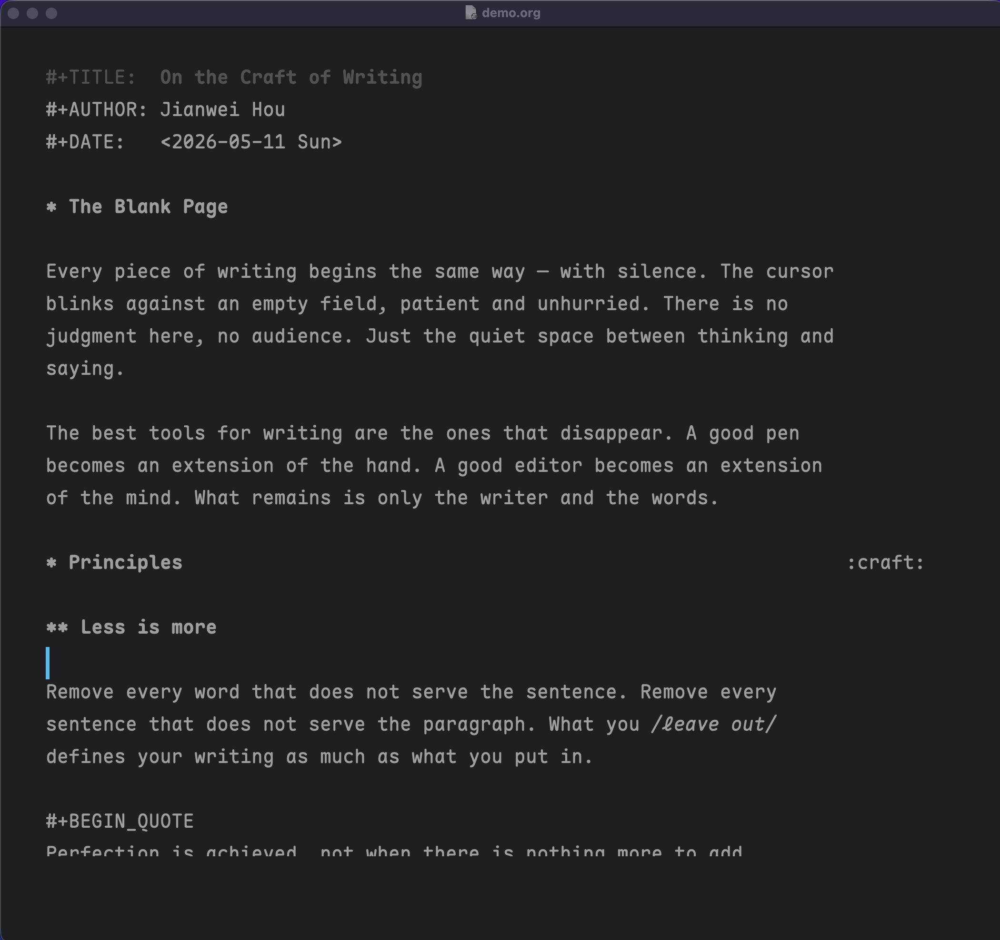

# zenwriter-mode for Emacs

A distraction-free writing environment for Emacs, inspired by [iA Writer](https://ia.net/writer). Monochromatic color theme with a signature blue cursor, zen writing modes, and visual-line focus dimming.




## Features

**Color theme** (`zenwriter-theme.el`)
- Light and dark variants, auto-detected from your frame background
- Monochromatic grays for light mode, subtle muted colors for dark mode
- First-class Org mode and Markdown faces — headings are bold, same size as body text
- Subtle link underlines for discoverability without visual noise
- Invisible modeline

**Zen writing mode** (`zenwriter-mode.el`)
- `zenwriter-mode` (buffer-local) — olivetti centering + generous line spacing
- `global-zenwriter-mode` — full zen: loads theme, sets font, hides toolbar/scrollbar/menubar/modeline, disables org-bars and org-modern if present, enables `zenwriter-mode` in all buffers. Toggling off restores your previous themes and settings.

**Focus mode**
- `zenwriter-focus-mode` (buffer-local) — dims all text except the current visual line
- `global-zenwriter-focus-mode` — focus mode in all buffers

## Prerequisites

### Font: Maple Mono CN

The theme uses [Maple Mono CN](https://github.com/subframe7536/maple-font) by default. Install it before using `global-zenwriter-mode`.

**macOS (Homebrew):**

```bash
brew install --cask font-maple-mono-cn
```

**Manual download:**

Download from [Maple Font releases](https://github.com/subframe7536/maple-font/releases) and install the `MapleMono-CN-*.ttf` files to your system fonts directory.

If you prefer a different font, set `zenwriter-font-family` before enabling the mode.

## Installation

### Manual

```bash
git clone https://github.com/jhou1/zenwriter-mode /path/to/zenwriter-mode
```

Add to your `init.el` or `.emacs`:

```elisp
(add-to-list 'custom-theme-load-path "/path/to/zenwriter-mode")
(add-to-list 'load-path "/path/to/zenwriter-mode")
(require 'zenwriter-mode)
```

### straight.el + use-package

```elisp
(use-package zenwriter-mode
  :straight (zenwriter-mode
    :type git
    :host github
    :repo "jhou1/zenwriter-mode"
    :files ("*.el"))
  :commands (zenwriter-mode global-zenwriter-mode
             zenwriter-focus-mode global-zenwriter-focus-mode)
  :init
  (add-to-list 'custom-theme-load-path
               (expand-file-name "straight/repos/zenwriter-mode"
                                 user-emacs-directory)))
```

## Usage

```elisp
;; Just the color theme
(load-theme 'zenwriter t)

;; Zen mode in the current buffer
(zenwriter-mode 1)

;; Full zen experience — all buffers, theme, font, hidden chrome
(global-zenwriter-mode 1)

;; Focus mode — dim everything except the current line
(global-zenwriter-focus-mode 1)
```

Toggle off with the same commands (or pass `-1`). `global-zenwriter-mode` restores your previous themes and UI state when disabled.

## Customization

| Variable | Default | Description |
|----------|---------|-------------|
| `zenwriter-font-family` | `"Maple Mono CN"` | Font set by `global-zenwriter-mode` |
| `zenwriter-line-spacing` | `8` | Extra line spacing in pixels |
| `zenwriter-body-width` | `100` | Text body width in columns (olivetti) |
| `zenwriter-focus-dimmed-color` | `nil` (auto) | Foreground color for dimmed text; when nil, reads from `font-lock-comment-face` |

Example:

```elisp
(setq zenwriter-font-family "Iosevka")
(setq zenwriter-body-width 90)
(setq zenwriter-line-spacing 6)
```

## Optional dependencies

- [olivetti](https://github.com/rnkn/olivetti) — text centering (detected at runtime, falls back to window margins)

## Requirements

- Emacs 26.1+

## License

GPL-3.0
